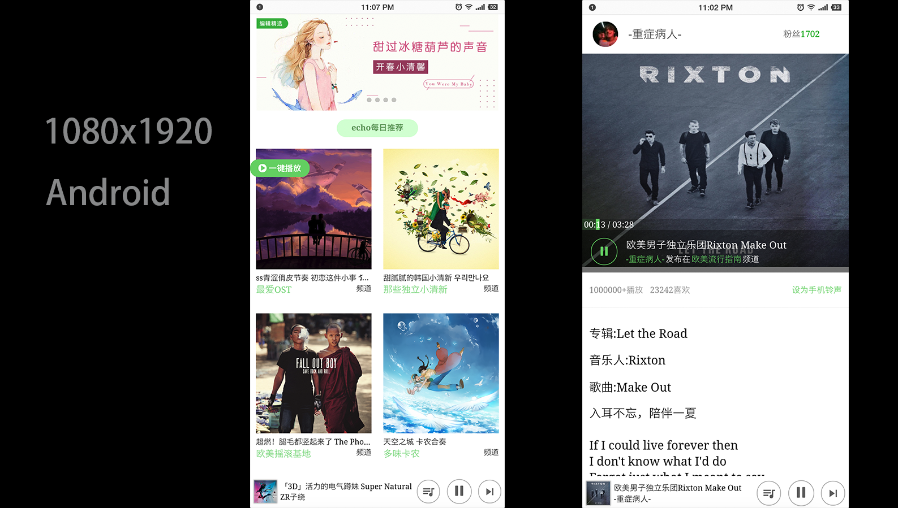

# vue-echo

仅仅是一个前端练手项目，用来学习下前端技术。

显示效果:


## 所用前端技术栈:
- Vue.js --响应式/组件化前端框架。
- Vuex --vuex中的状态管理库。
- Vue-Router --vue组件/页面间的路由管理。
- Stylus --CSS预编译框架，与LESS/SASS类似。
- mock.js --假数据模拟。
- flexable-rem --淘宝移动端页面适配库。

## Project setup
```
npm install
```

### Compiles and hot-reloads for development
```
npm run serve
```

### Compiles and minifies for production
```
npm run build
```

### Run your tests
```
npm run test
```

### Lints and fixes files
```
npm run lint
```

### Customize configuration
See [Configuration Reference](https://cli.vuejs.org/config/).

## 参考
[uncleLian/vue2-echo](https://github.com/uncleLian/vue2-echo)
